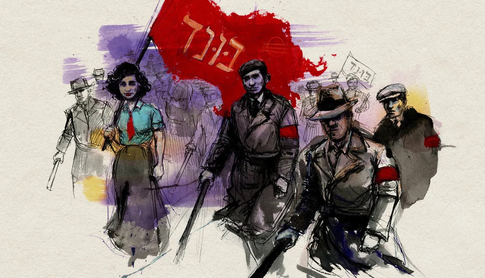
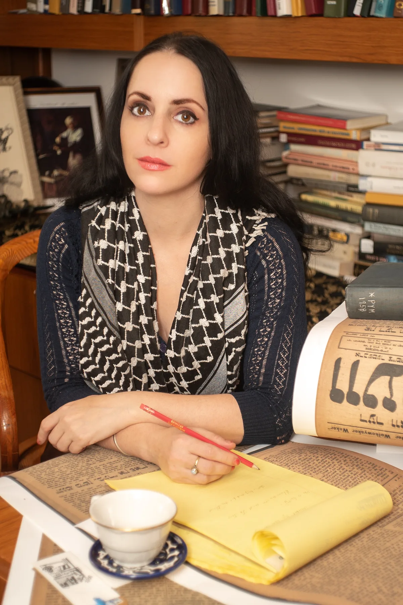

Molly Crabapple, som bland annat skapat serieromanen ”[Scarlett Takes Manhattan](https://dokumentera.sekvenser.se/dokument/scarlett-takes-manhattan/)”, medverkat i
ett par Marvel-antologier, serieantologin Occupy Comics och gjort flera omslag till amerikanska serietidningar, är aktuell med sin nya bok, ”Here Where We Live Is Our Country”, som inte är
en serieroman, utan en rikligt illustrerad bok om den judiska arbetarrörelsen som hennes gammelmorfar tillhörde.

På ABF i Stockholm 23/9 2026 deltar hon i ett samtal om boken med historikern och författaren Håkan Blomquist och kulturjournalisten Paulina Sokolow. Samtalet leds av Edgar Mannheimer.

Biljetter till samtalet kan [köpas hos ABF](https://abfstockholm.se/evenemang/boksamtal-molly-crabapple/).
