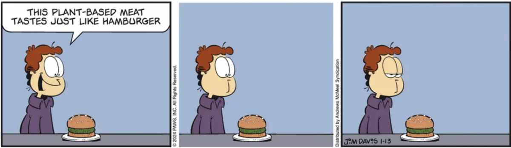

I essän ”Teckna, omteckna och bortteckna” lyfter den belgiska serieforskaren Benoît Crucifix fram flera exempel på hur man
genom att förändra existerande serier, kan skapa något helt nytt. Det kanske mest kända exemplet på detta är
den amerikanska serien ”Garfield Minus Garfield”, där irländaren Dan Walsh genom att ta bort
Katten Gustaf (Garfield) från serien, skapade ett helt ny innehåll. Serien blev plötsligt ångestfylld, och
känslan av ensamhet blir ibland extrem när Jon pratar för sig själv.

Det som gjorde det hela extra intressant, var att Jim Davis, skaparen av Gustaf, gillade projektet, och en samling
har publicerats i bokform.

Benoît lyfter fram fler exempel på hur man genom att förändra ett existerande verk, genom att bortteckna, omteckna och teckna skapar fristående verk, ibland större än originalet. Du kan läsa hela hans essä i första numret av Sekvenser, som ni kan köpa i vår [webbshopp](/#/webbshop).

Läs [Garfield Minus Garfield](https://garfieldminusgarfield.net/)
