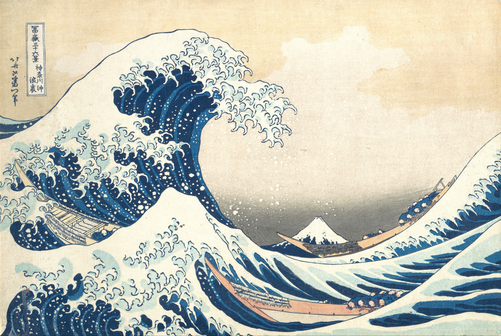
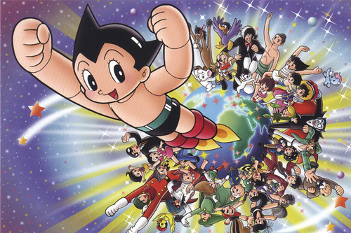

I nästa nummer av Sekvenser, nummer 4, samlar vi flera artiklar kring seriemediets historia. Det utges tyvärr mycket lite på svenska om ämnet, och de få böcker som finns hade behövt skrivas om flera gånger under årens lopp. Därför introducerar vi vinjetten ”Omtag”, där vi publicerar texter som tar nya tag om seriehistorien , i Sverige såväl som i resten av världen.

”Omtag” är tänkt som en återkommande avdelning.

Var har till exempel Hokosai och japanska tecknade serien gemensamt?

Bara ett ord visar det sig. Inget mer. Trots att motsatsen har upprepats gång på gång. Mer om detta i nummer 4 av Sekvenser.

Nästa nummer beräknas komma ut i slutet av oktober. Och fram tills dess kan du beställa våra tidigare nummer i
vår [webbshopp](/#/webbshop)