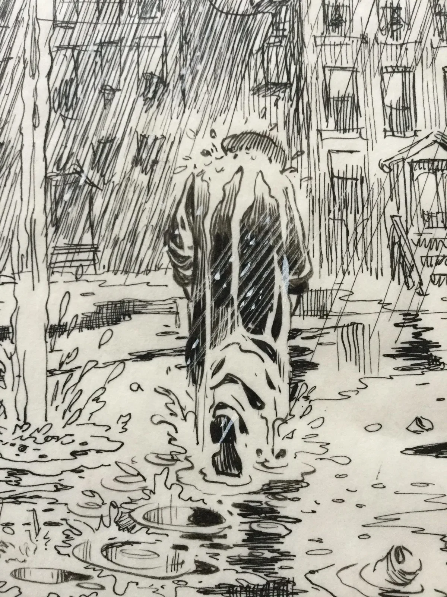
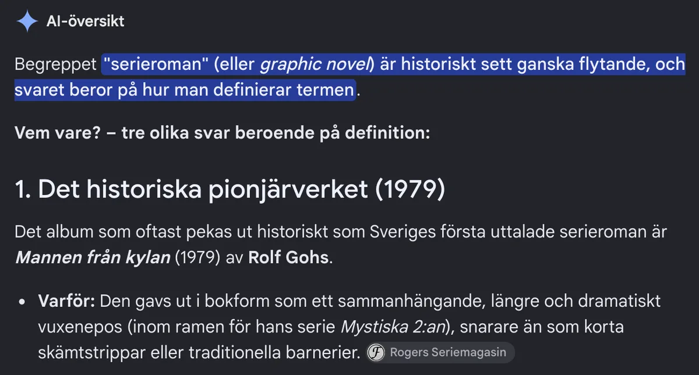

Det som vi i dag anser vara en serieroman, och vad som ansågs vara en serieroman när begreppet först ’lanserades’, kan skilja sig rejält åt.

Serieroman (en. ”graphic novel”) som uttryck var något som slog igenom i och med Will Eisners
bok ”Ett hus i Bronx” (en. ”A Contract with God”). Dock var boken ingen serieroman, utan en samling av serienoveller.

Men diskussionen om serieromanen som form började långt innan Eisner, och det är något vi tittar på i nästa nummer av _Sekvenser_. Med det kommer även frågan, vilken var den första svenska serieromanen?

Vi ska definitivt inte lita på vad Googles Gemini anser i alla fall.

Gemini anger [Rogers Seriemagasin](https://rogersmagasin.com/serieskapare-tecknare-och-manusforfattare/rolf-gohs/) som källa, men Roger Schaeder vet bättre än att hitta på en bok av Rolf Gohs som aldrig existerat. Det är vad som brukar kallas en AI-hallucination (eller på ren svenska, en lögn).
