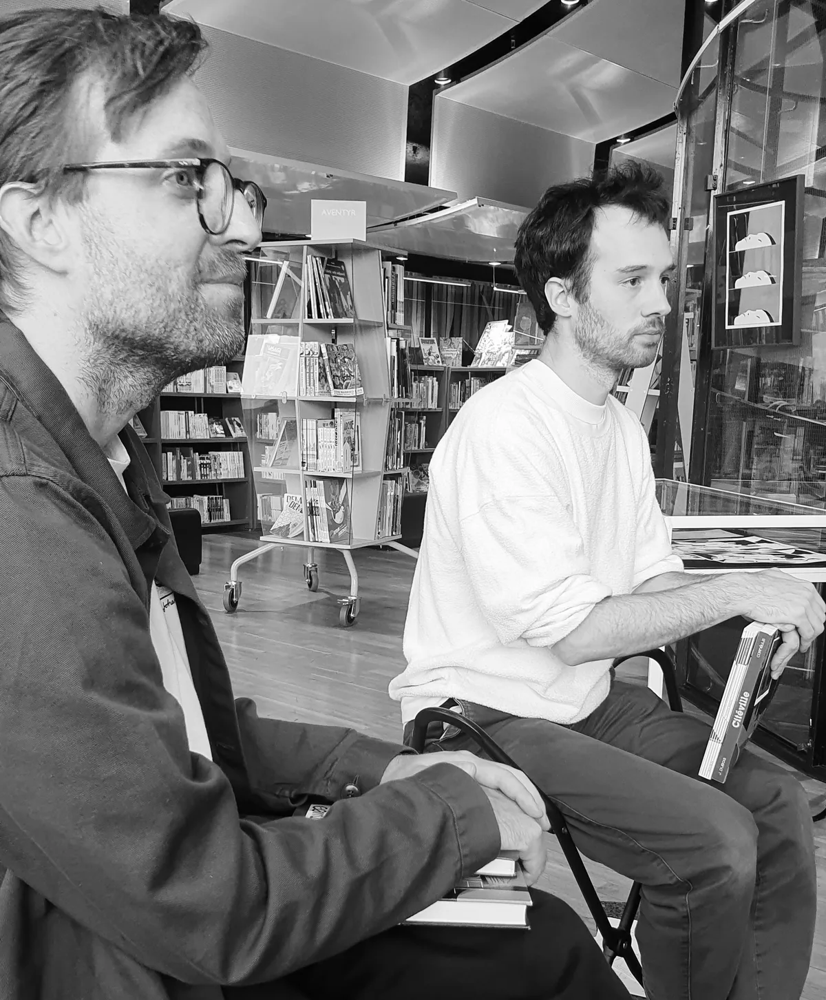

Den förste september invigdes en utställning med originalteckningar av den franska serieskaparen Jérôme Dubois på Serieteket i Stockholm.

.")

I samband med invigningen samtalade Robert Aman med Jérôme om hans serieskapande. Det blev ett intressant samtal kring skapandeprocesser, med ett speciellt fokus på ”[Immateriell](https://serieutgivning.sekvenser.se/book/9789199051123/)” som nu kommit på svenska på Lystring förlag. ”Immateriell” är den första boken av Jérôme som getts ut i Sverige, dock har två av hans kortare serier tidigare publicerats i [_Det grymma svärdet_ 43](https://serieutgivning.sekvenser.se/book/9789198759518/) (även denna från Lystring).

Tyvärr glömde jag att ta några foton på själva utställningen,  men om ni kan, ta ett besök på Serieteket och ta en titt själva, den hänger kvar fram till 14 september.
